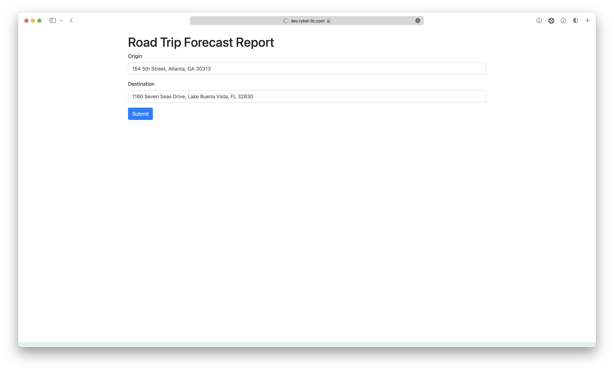
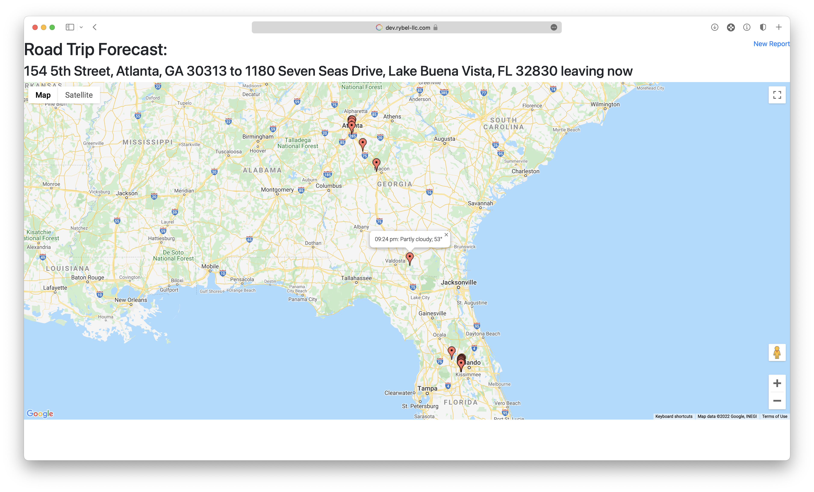

# Google Maps Graph
##### A visual representation of how long your trip will be based off of the time of day

## How it works
Simply tell it where you are starting from and where you are going. Hit submit, and you'll receive forecasts along your route for the time you'll be passing through.

## Installation
1. Get a Google Maps API key from [https://console.developers.google.com](https://console.developers.google.com)
1. Get a Weather API key from [https://weatherapi.com](https://weatherapi.com)
2. Update the credentials in `config example.ini`
3. Rename `config example.ini` to `config.ini`
4. Place the code on a server capable of running PHP
